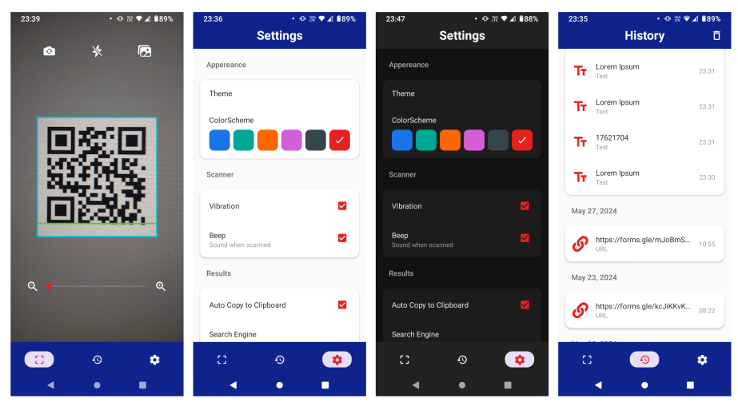

# QR Scanner App

A comprehensive QR code and barcode scanner application built with React Native and Expo. This app provides a complete solution for scanning, generating, and managing QR codes with a modern, customizable interface.

<div align="center">
  
</div>


## 🚀 Features

### Core Functionality
- **QR Code Scanning**: Real-time camera-based QR code and barcode scanning
- **Gallery Scanning**: Scan QR codes from existing images in your gallery
- **QR Code Generation**: Generate QR codes from any text or URL
- **Camera Controls**: Flash toggle, camera flip (front/back), zoom functionality
- **Auto-Detection**: Automatically detects URLs vs plain text

### User Experience
- **Scan History**: Complete history of all scanned codes organized by date
- **Auto Copy**: Automatic clipboard copying of scanned content
- **Auto URL Opening**: Automatically open URLs when scanned
- **Haptic Feedback**: Vibration feedback on successful scans
- **Audio Feedback**: Optional beep sound when scanning
- **Animated Scanner**: Professional scanning animation with targeting overlay

### Customization & Settings
- **Theme Support**: Light, dark, and automatic (system) themes
- **Color Schemes**: 6 different accent color options
- **Search Engine Selection**: Choose from Google, Bing, Yahoo, or Ecosia
- **Personalized Experience**: All settings persist across app sessions

### Content Management
- **QR Code Sharing**: Share generated QR codes with other apps
- **Download QR Codes**: Save QR codes to device gallery
- **History Management**: Bulk delete, select all, and organize scan history
- **Lazy Loading**: Optimized performance for large scan histories

The app features a modern material design interface with:
- Clean scanner interface with animated targeting overlay
- Intuitive bottom tab navigation
- Customizable color schemes
- Responsive design for all screen sizes

## 🛠️ Technology Stack

- **Framework**: React Native 0.74.5
- **Development Platform**: Expo SDK 51
- **Navigation**: React Navigation 6 (Stack & Material Bottom Tabs)
- **State Management**: React Context API
- **Storage**: AsyncStorage for persistent settings
- **Camera**: Expo Camera with barcode scanning
- **QR Generation**: react-native-qrcode-svg
- **Animations**: React Native Reanimated 3
- **Icons**: Expo Vector Icons (Material, Ionicons, etc.)

## 📦 Installation

### Prerequisites
- Node.js (14 or later)
- Expo CLI
- Android Studio / Xcode (for device testing)

### Setup
1. Clone the repository:
```bash
git clone <repository-url>
cd qr_scanner
```

2. Install dependencies:
```bash
npm install
```

3. Start the development server:
```bash
expo start
```

4. Run on device:
```bash
# Android
expo start --android

# iOS
expo start --ios
```

## 🏗️ Project Structure

```
src/
├── components/          # Reusable UI components
│   ├── Ads/            # Advertisement banners
│   ├── Alerts/         # Modal dialogs and alerts
│   ├── Buttons/        # Custom button components
│   └── LayoutComponents/ # Layout and UI elements
├── context/            # React Context providers
│   └── AppStateProvider.jsx  # Global app state
├── routes/             # Navigation configuration
│   ├── Routes.jsx      # Main router
│   ├── Tabs.jsx        # Bottom tab navigator
│   └── ScannerStack.jsx # Scanner stack navigator
├── utils/              # Utility functions
│   ├── AsyncStorageFunctions.js
│   └── dateFunctions.js
└── views/              # Main screen components
    ├── Scanner.jsx     # Camera scanner screen
    ├── ResultView.jsx  # Scan results and QR generation
    ├── History.jsx     # Scan history management
    └── Settings.jsx    # App configuration
```

## 🎯 Key Components

### Scanner Screen
- Real-time camera scanning with expo-barcode-scanner
- Camera controls (flash, flip, zoom)
- Gallery image scanning
- Animated scanner overlay
- Permission handling

### Result View
- Display scanned content
- Generate QR codes from content
- Copy to clipboard functionality
- Share and download options
- URL detection and opening

### History Management
- Chronological scan history
- Bulk selection and deletion
- Search and filter capabilities
- Lazy loading for performance
- Data persistence

### Settings
- Theme customization (light/dark/auto)
- Color scheme selection
- Scanner preferences (vibration, sound)
- Search engine configuration
- Auto-copy and auto-open settings

## ⚙️ Configuration

### Permissions
The app requires the following permissions:
- **Camera**: For QR code scanning
- **Media Library**: For saving QR codes and accessing gallery images


## 🎨 Customization

### Themes
- **Light Theme**: Clean white interface with blue accents
- **Dark Theme**: Material Design dark theme with proper contrast
- **Auto Theme**: Follows system theme preferences

